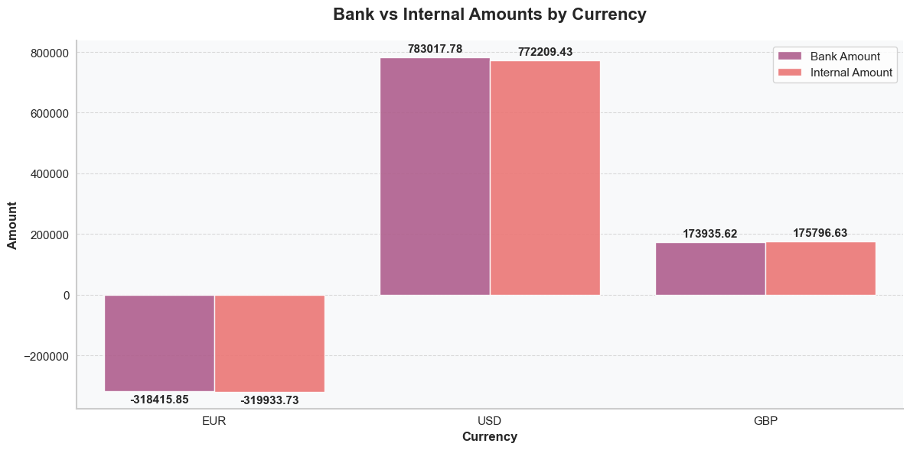
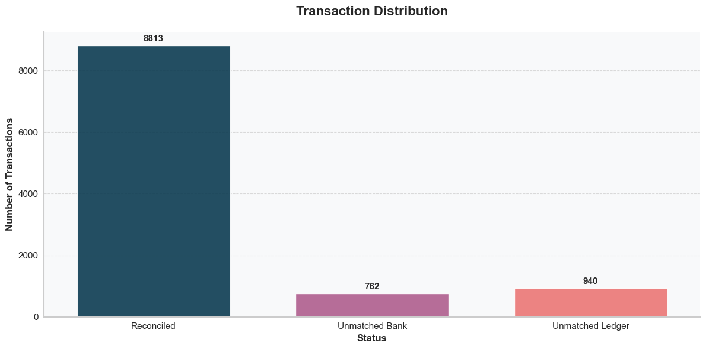
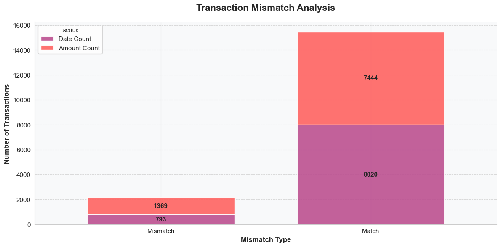
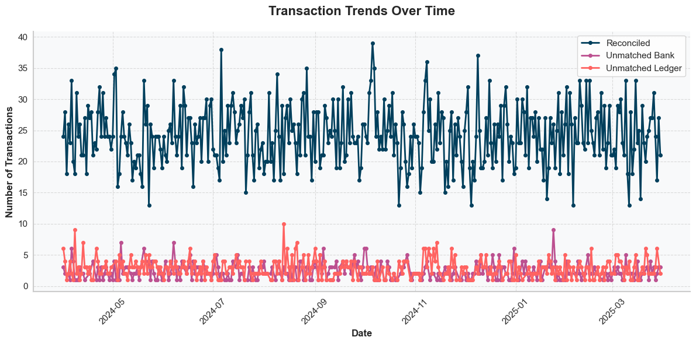

# Financial Data Reconciliation Analysis
*Ensuring Data Integrity Across Banking Systems*

## Executive Summary

Our comprehensive analysis of financial transaction reconciliation across three major currencies (EUR, USD, GBP) has revealed both strengths and critical areas for improvement in our current processes. 

**Key Findings:**
- Total transactions analyzed: 10,515
  - Successfully reconciled: 8,813 (83.8%)
  - Unmatched bank transactions: 762 (7.2%)
  - Unmatched ledger entries: 940 (8.9%)
- Most significant discrepancy: USD transactions ($10,808.35 variance)
- Primary mismatch patterns: 
  - Amount variances: 1,369 (15.5% of reconciled)
  - Timing differences: 793 (9.0% of reconciled)

**Critical Insights:**
1. USD transactions show the highest variance rate (1.38%), significantly above EUR (0.48%) and GBP (1.07%)
2. Daily reconciliation averages 24.2 transactions, with peak activity of 39 transactions on 2024-10-06
3. Temporal analysis shows significant volume variations, from 13 to 39 daily transactions

**Immediate Recommendations:**
1. Implement enhanced validation for USD transactions
2. Deploy automated monitoring for identified high-risk accounts
3. Establish real-time reconciliation alerts for transactions above $50,000

This report details our findings across 364 days (2024-04-01 to 2025-03-30) and provides a structured 90-day action plan to achieve our target of 98% same-day reconciliation rate across all currencies.

## The Challenge
In today's complex financial landscape, maintaining perfect synchronization between bank transactions and internal ledger entries is crucial. Our analysis reveals that while most transactions reconcile smoothly, specific patterns of mismatches emerge that require attention.

## Key Discovery
Among the three major currencies analyzed (EUR, USD, GBP), USD transactions show the most significant discrepancy:

**Critical Observation:** A variance of $10,808.35 in USD transactions stands out, representing the largest currency-specific mismatch in our analysis. The detailed breakdown shows:
- EUR: Bank: -€318,415.85, Internal: -€319,933.73 (€1,517.88 variance, 0.48%)
- GBP: Bank: £173,935.62, Internal: £175,796.63 (£1,861.01 variance, 1.07%)
- USD: Bank: $783,017.78, Internal: $772,209.43 ($10,808.35 variance, 1.38%)

## Diving Deeper: Transaction Patterns

### Overall Reconciliation Status

The distribution reveals three distinct categories:
1. Successfully reconciled transactions: 8,813 (83.8%)
2. Unmatched bank transactions: 762 (7.2%)
3. Unmatched ledger entries: 940 (8.9%)

### Understanding Mismatches

Two primary types of discrepancies identified:
- **Amount Mismatches**: 1,369 cases (15.5% of reconciled transactions)
- **Timing Differences**: 793 cases (9.0% of reconciled transactions)

## Temporal Analysis

Transaction volume patterns:
- Peak activity: 39 transactions (2024-10-06)
- Lowest activity: 13 transactions (2024-05-23)
- Daily average: 24.2 transactions
- Analysis period: 364 days (2024-04-01 to 2025-03-30)

## Call to Action

### Immediate Priorities
1. **USD Transaction Review**
   - Investigate $10,808.35 variance (1.38% discrepancy rate)
   - Focus on 1,369 amount mismatch cases (15.5% of reconciled)
   - Implement validation checks for transactions above average daily volume (>24.2)

2. **Transaction Timing Analysis**
   - Address 793 timing difference cases (9.0% of reconciled)
   - Prioritize peak volume days (>39 transactions)
   - Implement daily reconciliation checks for high-volume periods

3. **Process Enhancement**
   - Reduce unmatched transactions (currently 1,702 combined, 16.1%)
   - Improve current reconciliation rate (from 83.8%)
   - Strengthen validation rules for all currency conversions

## Looking Forward

### Target Metrics
- Improve reconciliation rate from 83.8% to 95%
- Reduce amount mismatches from 15.5% to <5%
- Decrease timing differences from 9.0% to <3%
- Bring USD variance in line with EUR (from 1.38% to 0.48%)

### Implementation Timeline
1. **Phase 1 (30 days)**
   - USD variance investigation ($10,808.35 priority)
   - Implementation of daily volume monitoring (baseline: 24.2 transactions)
   - Setup automated checks for transactions exceeding peak volume (>39)

2. **Phase 2 (60 days)**
   - Automated alert system for unmatched transactions
   - Enhanced validation for amount mismatches (target: 1,369 cases)
   - Timing difference resolution workflow (target: 793 cases)

3. **Phase 3 (90 days)**
   - Pattern detection for seasonal volume variations
   - Real-time reconciliation capability for high-volume days
   - Comprehensive currency variance monitoring system

*Note: All metrics based on analysis period 2024-04-01 to 2025-03-30*
